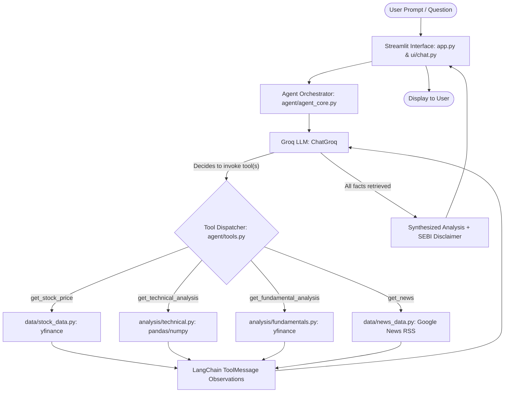

# Financial Research & Analytics AI Agent
### Intelligent Indian Equity Research Assistant (NSE & BSE)

[](https://www.python.org/)
[](https://streamlit.io/)
[](https://www.nseindia.com/)
[](https://www.langchain.com/)
[](https://groq.com/)
[](tests/)

---

## 1. Project Title
**Financial Research & Analytics AI Agent: An Autonomous Multi-Factor Equity Research Assistant for the Indian Stock Market**

---

## 2. Project Overview
The **Financial Research & Analytics AI Agent** is an end-to-end financial intelligence application designed to assist investors, analysts, and students in analyzing equities listed on the **National Stock Exchange (NSE)** and the **Bombay Stock Exchange (BSE)**. 

The application brings together historical OHLCV pricing, technical indicators, fundamental balance sheet metrics, and live financial news into a unified interface. Underneath the dashboard lies an autonomous **ReAct (Reasoning + Acting)** AI agent powered by **LangChain** and **Groq**, enabling natural-language queries that trigger automated tool execution and generate comprehensive, institutional-style equity research reports.

---

## 3. Problem Statement
Analyzing equities in the Indian market is traditionally fragmented and time-consuming:
- **Disparate Sources:** Investors must consult separate platforms for charting, fundamental ratios (P/E, ROE, P/B), and recent financial news.
- **LLM Hallucinations:** Generic Large Language Models cannot accurately answer financial questions because they lack real-time access to market data and produce fabricated stock prices or ratios.
- **Manual Synthesis Overhead:** Combining technical momentum, financial health, and news sentiment into a cohesive investment memo requires extensive manual data compilation.

---

## 4. Objectives
- **Automate Market Data Ingestion:** Retrieve real-time and historical quotes for NSE/BSE securities using Yahoo Finance API feeds with automatic ticker normalization.
- **Quantitative Technical Analysis:** Calculate moving averages (SMA 20/50, EMA 20), Relative Strength Index (RSI), MACD, and Bollinger Bands with interactive Candlestick visualizations.
- **Fundamental Health Assessment:** Extract core valuation ratios (Trailing P/E, Price-to-Book, Return on Equity, Net Profit Margin, Market Capitalization).
- **News Aggregation:** Ingest real-time headlines and development updates via Google News RSS for Indian equities.
- **Autonomous Tool-Calling Agent:** Implement a ReAct agent using LangChain and Groq that dynamically picks the right financial tools and synthesizes multi-factor answers.
- **Defensive Error Handling:** Ensure all missing/NaN financial metrics display gracefully as `"N/A"` without runtime crashes.
- **Regulatory Compliance:** Uphold SEBI and educational compliance through persistent disclaimers.

---

## 5. Key Features
- **Interactive Financial Dashboard:**
  - Plotly Candlestick Chart with 20-period and 50-period Simple Moving Average overlays.
  - Real-time Price Metrics: Current Price, Daily Absolute & Percentage Change, and Trading Volume.
  - Quantitative Indicators: RSI (14-day), SMA 20, SMA 50, and MACD.
  - Fundamental Multiples: P/E Ratio, P/B Ratio, ROE (%), Profit Margin (%), Sector, and Industry.
  - Live News Feed: Latest corporate headlines with publication timestamps and direct URLs.
- **Autonomous AI Research Agent:**
  - Natural-language reasoning powered by Groq's high-speed inference engine.
  - Dynamic tool calling across price, technicals, fundamentals, and news tools.
  - Automatic synthesis of structured 5-part research memos for multi-factor queries.
- **Conversational Streamlit UI:**
  - Modern `st.chat_input()` and `st.chat_message()` conversational design with session-state memory.
  - 5 one-click suggested prompt buttons for live viva/demo testing.
  - Persistent state: Dashboard charts remain displayed while chatting with the AI agent.
- **Defensive Data Handling:**
  - Auto-normalizes raw symbols (e.g. `RELIANCE` → `RELIANCE.NS`).
  - Converts `None`, `NaN`, and missing ratios into clean `"N/A"` indicators instead of unhandled crashes.

---

## 6. Architecture & Workflow



### The ReAct Execution Loop:
1. **User Query:** The user enters a question (e.g. *"What is the current stock price and RSI of TCS?"*).
2. **Intent & Tool Selection:** Groq analyzes the prompt against the registered tool schemas (`get_stock_price`, `get_technical_analysis`, etc.) and returns structured `tool_calls`.
3. **Execution & Observation:** The dispatcher executes the Python functions safely, converts the results to JSON strings, and injects them as `ToolMessage` entries.
4. **Reasoning & Synthesis:** The LLM inspects the data. If additional tools are required, it calls them sequentially; otherwise, it formats the final response with markdown tables, interpretations, and disclaimers.

---

## 7. Technology Stack
- **Programming Language:** Python 3.10+
- **LLM & Agent Framework:** [LangChain](https://www.langchain.com/), [langchain-groq](https://github.com/groq/groq-python)
- **Inference Engine:** [Groq Cloud API](https://console.groq.com/)
- **Market Data Provider:** [yfinance](https://github.com/ranaroussi/yfinance) (Yahoo Finance API)
- **News Ingestion:** Requests + Python XML `ElementTree` (Google News RSS)
- **Data Manipulation:** [Pandas](https://pandas.pydata.org/), [NumPy](https://numpy.org/)
- **Data Visualization:** [Plotly](https://plotly.com/python/) (Graph Objects)
- **Web Application Framework:** [Streamlit](https://streamlit.io/)
- **Configuration & Environment:** [python-dotenv](https://github.com/theskumar/python-dotenv)
- **Testing Suite:** [pytest](https://docs.pytest.org/), `unittest`

---

## 8. Project Folder Structure

```text
financial-research-ai-agent/
│
├── agent/                          # Core AI Agent & Tools
│   ├── __init__.py                 # Agent package marker
│   ├── agent_core.py               # ReAct agent loop, ChatGroq, and run_agent()
│   └── tools.py                    # Tool implementations with defensive error handling
│
├── analysis/                       # Quantitative Analysis Engines
│   ├── __init__.py                 # Analysis package marker
│   ├── fundamentals.py             # Fundamental metrics extractor (P/E, ROE, P/B)
│   └── technical.py                # Technical indicators engine (RSI, SMA, EMA, MACD)
│
├── config/                         # Application Configuration
│   ├── __init__.py                 # Config package marker
│   └── settings.py                 # Application metadata, tickers, and constants
│
├── data/                           # External Data Retrieval Modules
│   ├── __init__.py                 # Data package marker
│   ├── news_data.py                # Google News RSS parser
│   └── stock_data.py               # yfinance OHLCV and corporate info fetcher
│
├── tests/                          # Automated Pytest Test Suite
│   ├── __init__.py                 # Tests package marker
│   ├── test_agent_live.py          # Live end-to-end verification of all 5 query types
│   ├── test_agent_suite.py         # Unit tests for ticker normalization & agent loop
│   ├── test_fundamentals.py        # Unit tests for fundamental ratios
│   ├── test_news.py                # Unit tests for news RSS parser
│   ├── test_stock_data.py          # Unit tests for historical stock data
│   └── test_technical.py           # Unit tests for technical indicator math
│
├── ui/                             # User Interface Components
│   ├── __init__.py                 # UI package marker
│   └── chat.py                     # Streamlit chat interface (st.chat_input, chips)
│
├── .env.example                    # Template for environment variables
├── app.py                          # Main Streamlit web application
├── requirements.txt                # Python package dependencies
└── README.md                       # Project documentation
```

---

## 9. Installation Steps

### Prerequisites
- Python 3.10 or higher installed.
- Git installed on your system.

### 1. Clone the Repository
```bash
git clone https://github.com/apoorva14-unique/financial-research-ai-agent.git
cd financial-research-ai-agent
```

### 2. Create and Activate Virtual Environment
- **Windows (PowerShell):**
  ```powershell
  python -m venv .venv
  .\.venv\Scripts\Activate.ps1
  ```
- **macOS / Linux:**
  ```bash
  python3 -m venv .venv
  source .venv/bin/activate
  ```

### 3. Install Required Dependencies
```bash
pip install -r requirements.txt
pip install pytest
```

---

## 10. Environment Setup (`.env`)

The application uses Groq's high-speed LPU API for agent reasoning. 

1. Copy the provided `.env.example` file to `.env`:
   - **Windows:**
     ```powershell
     copy .env.example .env
     ```
   - **macOS / Linux:**
     ```bash
     cp .env.example .env
     ```

2. Open `.env` and add your Groq API key:
   ```env
   GROQ_API_KEY=gsk_your_groq_api_key_here
   ```
   *(Optional: You can specify `GROQ_MODEL=openai/gpt-oss-120b` or let the agent use the built-in verified default model).*

> **Security Note:** Never commit your `.env` file to version control. It is already included in `.gitignore`.

---

## 11. How to Run the Streamlit Application

Launch the full interactive financial dashboard and AI research assistant:
```powershell
streamlit run app.py
```
After running the command, open your browser and navigate to:
```
http://localhost:8501
```

*(Optional: To run only the AI Research Assistant chat interface standalone, run: `streamlit run ui/chat.py`)*

---

## 12. Example AI Assistant Questions

The AI Research Assistant dynamically determines user intent and answers questions across 5 core categories:

1. **Current Stock Price:**
   > *"What is the current stock price of Reliance?"*  
   > *(Fetches last traded price, daily high, daily low, and volume).*
2. **Technical Indicators:**
   > *"Analyze the technical indicators of Reliance."*  
   > *(Fetches RSI 14-day, SMA 20/50, EMA 20, and MACD with trend interpretation).*
3. **Fundamental Valuation:**
   > *"What are the fundamentals of TCS?"*  
   > *(Fetches P/E ratio, P/B ratio, ROE, Profit Margin, Market Cap, and Sector).*
4. **Recent Financial News:**
   > *"What are the latest news about Infosys?"*  
   > *(Retrieves latest headlines, publication dates, and source links).*
5. **Combined Research Summary:**
   > *"Give me a brief research summary of Reliance."*  
   > *(Coordinates all 4 tools and synthesizes an executive summary, technical breakdown, valuation summary, sentiment check, and takeaway).*

---

## 13. Technical Analysis Features
Calculated via `analysis/technical.py` using Pandas rolling and exponential windows:
- **Simple Moving Average (SMA 20 & SMA 50):** 20-period short-term momentum and 50-period trend baseline.
- **Exponential Moving Average (EMA 20):** Faster-reacting average weighting recent price movements.
- **Relative Strength Index (RSI - 14 Period):** Measures price velocity; levels > 70 suggest overbought conditions, while < 30 suggest oversold conditions.
- **Moving Average Convergence Divergence (MACD):** Difference between 12-day and 26-day EMAs, accompanied by a 9-day signal EMA line.
- **Bollinger Bands:** 20-period moving average with upper and lower bands positioned at 2 standard deviations.

---

## 14. Fundamental Analysis Features
Extracted via `analysis/fundamentals.py`:
- **Trailing P/E & Forward P/E:** Evaluates valuation multiples relative to historical and forecasted earnings.
- **Price-to-Book (P/B) Ratio:** Compares market value against net book value.
- **Return on Equity (ROE):** Formatted as a clean percentage (e.g. `47.74%`) reflecting capital efficiency.
- **Net Profit Margin:** Formatted as a percentage (e.g. `6.61%`) showing operational profitability.
- **Classification Data:** Market Capitalization, Sector, and Industry category.

---

## 15. Financial News Features
Integrated via `data/news_data.py`:
- Real-time RSS search queried against Google News for Indian equity topics.
- Extracts headline titles, publication timestamps, and verified source URLs.
- Filtered and structured into markdown tables for analyst review.

---

## 16. Testing Instructions

The project features a comprehensive automated test suite with **13 unit tests** covering all modules and tools.

### Run All Pytest Tests (Quiet Mode)
```powershell
python -m pytest -q
```
*Expected Result: `13 passed in ~10s`.*

### Run Detailed Pytest Breakdown (Verbose Mode)
```powershell
python -m pytest -v
```

### Run Live End-to-End Agent Verification
Executes real-time agent queries for stock price, technicals, fundamentals, news, and combined research summaries:
```powershell
python -m tests.test_agent_live
```

---

## 17.🌐 Deployment

The application is deployed using Streamlit Community Cloud.

Live Application

👉 Open the Live Application - https://financial-research-ai-agent-bbq6pcsg4njqsvfi4tt3en.streamlit.app/

The deployed application uses the Groq API key through secure deployment secrets rather than storing credentials in the GitHub repository.

## 18. Regulatory & Educational Disclaimer

> **DISCLAIMER:**  
> This software is strictly developed for **educational and academic research purposes** as part of a final project submission. It is **not** registered with the Securities and Exchange Board of India (SEBI) as an investment advisor.  
>  
> The information, analytics, and AI-generated outputs presented in this dashboard do **not** constitute financial advice, investment recommendations, or an endorsement to buy or sell any securities. Always consult a certified financial advisor before making any financial investment decisions.

---

## 19. Future Enhancements
- **Export to PDF:** Ability to download generated multi-page equity research reports as branded PDF files.
- **Peer Comparison Matrix:** Side-by-side radar and tabular comparison between sector rivals (e.g. TCS vs. Infosys vs. Wipro).
- **Portfolio Risk Analytics:** Calculation of portfolio-level metrics including Beta, Value at Risk (VaR), and Sharpe Ratio.
- **Voice Interface:** Voice-to-text querying using Whisper models for hands-free financial analysis.

---

⭐ Acknowledgement

This project was developed as a B.Tech/internship project to explore financial analytics, Python development, Streamlit application development, and tool-using AI agents.